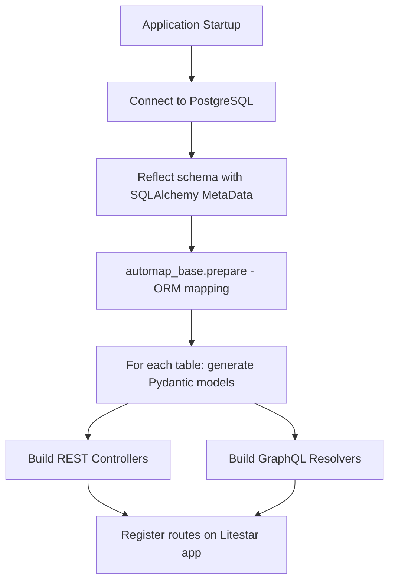

# Automatic API Generation via Database Introspection

## Overview

FusionServe's core capability is **zero-boilerplate API generation**: point it at a PostgreSQL database and it automatically discovers every table in the target schema, builds typed Pydantic models, and wires up both REST and GraphQL endpoints — all at application startup, with no hand-written code required.

---

## How It Works



### 1. Schema Reflection

At startup, [`introspect()`](../../src/fusionserve/persistence.py) creates a synchronous SQLAlchemy engine and calls `MetaData.reflect()` against the configured schema (`pg_app_schema`, default `app_public`).  This reads every table, column, primary key, nullable flag, column comment, and foreign-key constraint directly from the PostgreSQL system catalogs — no migration files or model classes required.

```python
metadata = MetaData()
metadata.reflect(bind=_engine, schema=settings.pg_app_schema)
```

### 2. ORM Mapping

After reflection, [`automap_base`](../../src/fusionserve/persistence.py) converts the raw metadata into mapped ORM classes so that SQLAlchemy can execute full CRUD operations through them:

```python
Base = automap_base(metadata=metadata)
Base.prepare()   # creates Base.classes.<table_name> for each table
```

### 3. Pydantic Model Generation

For each reflected table, FusionServe generates **four purpose-specific Pydantic models** using [`create_model()`](../../src/fusionserve/persistence.py):

| Model variant | Purpose | PK fields | Nullable handling |
|---|---|---|---|
| `model` | Full read / write representation | included | mirrors DB nullability |
| `get_input` | Query-string equality filter | included | all fields optional |
| `create_input` | POST request body | excluded | non-PK fields optional |
| `pk_input` | Primary-key path parameters | PK only | required |

Column types are resolved via SQLAlchemy's `column.type.python_type`; unsupported types fall back to `str`.  Column comments are forwarded as Pydantic `Field(description=...)` so they surface in the OpenAPI schema.

The generated model names follow PascalCase:  a table `invoices` produces `InvoiceModel`, `InvoiceGetInput`, `InvoiceCreateInput`, `InvoicePkInput`.

---

## Table Name Convention

FusionServe **requires all table names to be plural** (e.g. `users`, `invoices`, `order_items`).  The [`inflect`](https://pypi.org/project/inflect/) library is used to derive the singular form used in path parameters and response descriptions.  An exception is raised at startup if a non-plural table name is detected.

---

## Configuration

| Setting | Default | Description |
|---|---|---|
| `pg_host` | `localhost` | PostgreSQL host |
| `pg_port` | `5432` | PostgreSQL port |
| `pg_user` | `fusionserve` | Database user |
| `pg_password` | — | Database password |
| `pg_database` | `fusionserve` | Database name |
| `pg_app_schema` | `app_public` | Schema to introspect |
| `echo_sql` | `false` | Log generated SQL to stdout |

---

## Models Registry

The output of introspection is a **models registry** — a dictionary mapping each table name to a [`RegistryItem`](../../src/fusionserve/models.py) that holds the four Pydantic model variants.  This registry is passed to both the REST and GraphQL builders, making it the single source of truth for all generated APIs.

```python
models_registry: dict[str, RegistryItem] = {
    "users":    RegistryItem(model=..., get_input=..., create_input=..., pk_input=...),
    "invoices": RegistryItem(...),
    ...
}
```

---

## Startup Flow

```
uvicorn start
  └─ lifespan()                      # asynccontextmanager
       ├─ introspect()               # reflect + automap + generate models
       ├─ rest.build_controllers()   # create Litestar controllers
       └─ app.register(controller)   # mount routes dynamically
```

Everything happens inside the [Litestar `lifespan`](../../src/fusionserve/main.py) context manager, so the database is only queried once and all generated routes are available before the first HTTP request is served.
