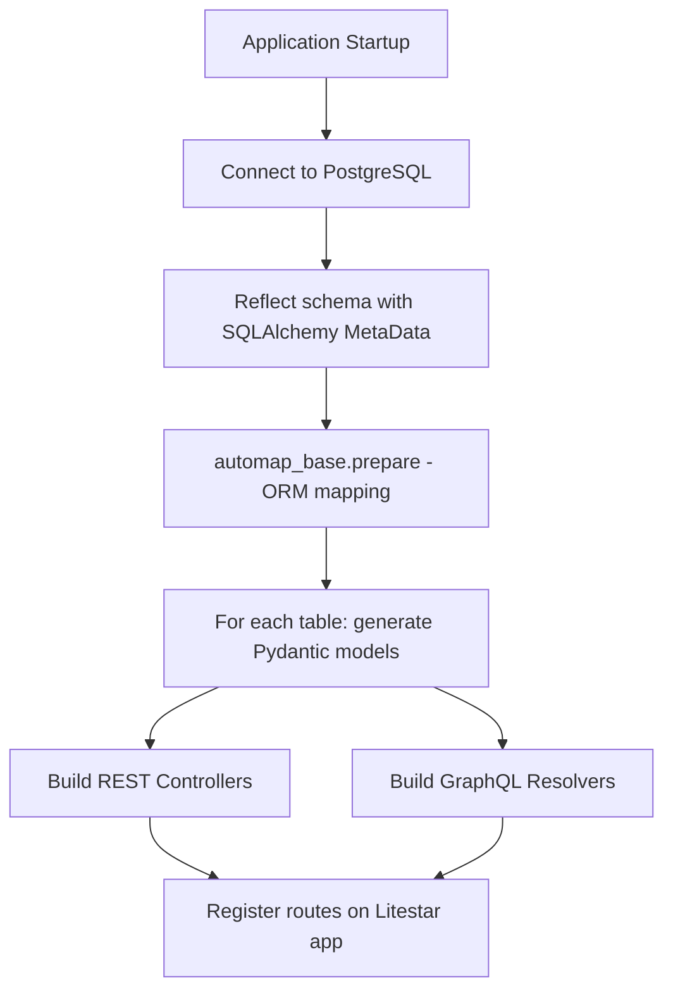

# Automatic API Generation via Database Introspection

## Overview

FusionServe's core capability is **zero-boilerplate API generation**: point it at a PostgreSQL database and it automatically discovers every table in the target schema, builds typed Pydantic models, and wires up both REST and GraphQL endpoints — all at application startup, with no hand-written code required.

---

## How It Works


```mermaid
flowchart TD
    A[Application Startup] --> B[Connect to PostgreSQL]
    B --> C[Reflect schema with SQLAlchemy MetaData]
    C --> D[automap_base.prepare - ORM mapping]
    D --> E[For each table: generate Pydantic models]
    E --> F[Build REST Controllers]
    E --> G[Build GraphQL Resolvers]
    F --> H[Register routes on Litestar app]
    G --> H
```

### 1. Schema Reflection

At startup, [`introspect()`](../../src/fusionserve/persistence.py) creates a synchronous SQLAlchemy engine and calls `MetaData.reflect()` against the configured schema (`pg_app_schema`, default `app_public`).  This reads every table, column, primary key, nullable flag, column comment, and foreign-key constraint directly from the PostgreSQL system catalogs — no migration files or model classes required.

```python
metadata = MetaData()
metadata.reflect(bind=_engine, schema=settings.pg_app_schema)
```

### 2. ORM Mapping

After reflection, [`automap_base`](../../src/fusionserve/persistence.py) converts the raw metadata into mapped ORM classes so that SQLAlchemy can execute full CRUD operations through them:

```python
Base = automap_base(metadata=metadata)
Base.prepare()   # creates Base.classes.<table_name> for each table
```

### 3. Pydantic Model Generation

For each reflected table, FusionServe generates **three purpose-specific Pydantic models** on the fly in [`rest.py`](../../src/fusionserve/rest.py) via `create_model()` (there is no shared registry — each controller derives its models directly from its ORM class's `__table__`):

| Model variant | Builder | Purpose | Field handling |
|---|---|---|---|
| `model` | `create_response_model` | Read responses (GET/POST/PATCH result) | one field per column, mirrors DB nullability |
| `get_input` | `create_get_input_model` | Query-string equality filters | one optional field per column |
| `create_input` | `create_create_input_model` | POST request body | columns with a server- or Python-side default become optional; non-nullable columns without a default stay required |

Primary-key path parameters are not a Pydantic model: the path template is built from the table's PK columns directly (typed as `:uuid` segments).

Column types are resolved via SQLAlchemy's `column.type.python_type`; unsupported types fall back to `str`.  Column comments are forwarded as Pydantic `Field(description=...)` so they surface in the OpenAPI schema.

The generated model names follow PascalCase:  a table `invoices` produces `InvoiceModel`, `InvoiceGetInput`, and `InvoiceCreateInput`.

---

## Table Name Convention

FusionServe **requires all table names to be plural** (e.g. `users`, `invoices`, `order_items`).  The [`inflect`](https://pypi.org/project/inflect/) library is used to derive the singular form used in path parameters and response descriptions.  An exception is raised at startup if a non-plural table name is detected.

---

## Configuration

| Setting | Default | Description |
|---|---|---|
| `pg_host` | `localhost` | PostgreSQL host |
| `pg_port` | `5432` | PostgreSQL port |
| `pg_user` | `fusionserve` | Database user |
| `pg_password` | — | Database password |
| `pg_database` | `fusionserve` | Database name |
| `pg_app_schema` | `app_public` | Schema to introspect |
| `pg_pool_size` | `50` | Persistent connections in the async engine's pool (plus SQLAlchemy's default `max_overflow` of 10) |
| `pg_pool_timeout` | `30` | Seconds to wait for a free pooled connection before raising `TimeoutError` |
| `echo_sql` | `false` | Log generated SQL to stdout |

---

## No shared registry

The output of introspection is an [`Introspection`](../../src/fusionserve/models.py) object carrying the automap `Base`, the set of view names, and discovered PG functions. There is **no** intermediate model registry: the REST and GraphQL builders each iterate `Base.classes` and derive every Pydantic / Strawberry type they need from each ORM class's `__table__` at build time. The live PostgreSQL schema is the single source of truth.

---

## Startup Flow

```
uvicorn start
  └─ lifespan()                             # asynccontextmanager
       ├─ introspect()                      # reflect + automap -> Introspection
       ├─ rest.build(introspection)         # per-table CRUD controllers
       ├─ rest.build_function_controllers() # PG-function controllers
       ├─ graphql.build(introspection)      # GraphQL controller
       └─ app.register(...)                 # mount routes dynamically
```

Everything happens inside the [Litestar `lifespan`](../../src/fusionserve/main.py) context manager, so the database is only queried once and all generated routes are available before the first HTTP request is served.
